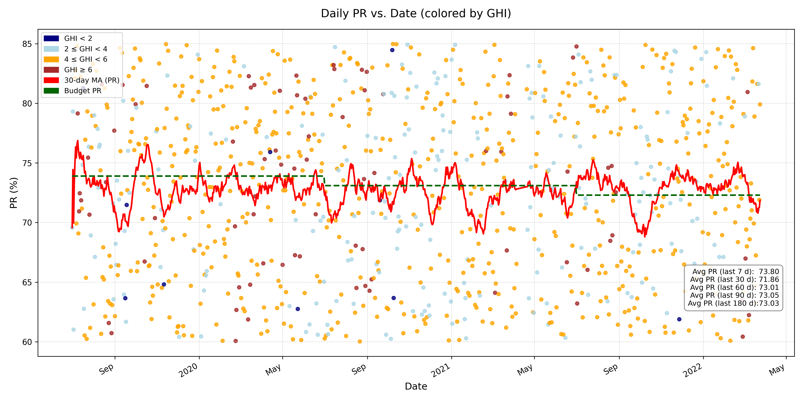

# Solar Data Analysis Project

This project analyzes solar radiation data from multiple stations to understand patterns and trends in solar energy potential across different locations.
## Screenshot


## Project Structure

```
solar_data/
├── data/                  # Data directory
│   ├── raw/              # Raw data files
│   └── processed/        # Processed data files
├── notebooks/            # Jupyter notebooks
│   └── script.ipynb      # Main analysis notebook
├── src/                  # Source code
│   ├── data/            # Data processing modules
│   ├── features/        # Feature engineering modules
│   ├── models/          # Machine learning models
│   └── visualization/   # Visualization modules
├── tests/               # Test files
├── .gitignore          # Git ignore file
└── README.md           # Project documentation
```

## Setup

1. Clone the repository:
```bash
git clone [repository-url]
cd solar_data
```

2. Create a virtual environment (recommended):
```bash
python -m venv venv
source venv/bin/activate  # On Windows: venv\Scripts\activate
```

3. Install dependencies:
```bash
pip install -r requirements.txt
```

## Data

The project uses solar radiation data from multiple stations. The data is organized as follows:
- Raw data is stored in the `data/raw/` directory
- Processed data is stored in the `data/processed/` directory

## Usage

1. Start Jupyter Notebook:
```bash
jupyter notebook
```

2. Open `notebooks/script.ipynb` to run the analysis

## Project Components

### Data Processing
- Raw data cleaning and preprocessing
- Data validation and quality checks
- Feature engineering

### Analysis
- Solar radiation pattern analysis
- Statistical analysis
- Time series analysis

### Visualization
- Interactive plots
- Statistical visualizations
- Geographic data visualization

## Contributing

1. Fork the repository
2. Create a feature branch
3. Commit your changes
4. Push to the branch
5. Create a Pull Request

## License

[Add your license information here]

## Contact

[Add your contact information here] 
